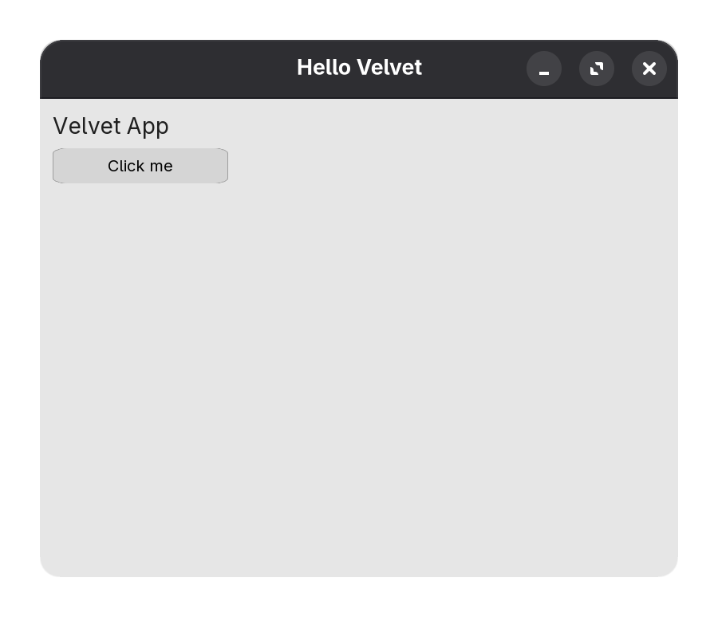

# Velvet API Reference

Velvet is a beginner-friendly C++ GUI framework built on SFML.  
This documentation is focused on **how to build screens quickly** and **how each widget is configured**.

## Core idea

Build a tree of widgets, then add the **root** to a `Window`:

1. Create a `Window`
2. Create layout containers (`HStack` / `VStack`)
3. Add widgets (`Label`, `Button`, `Slider`, `Image`, etc.)
4. Bind callbacks (`onclick`, `onchange`)

4. Start the event loop with `window.run()`

Velvet handles:

- event forwarding
- rendering
- cursor updates
- simple layout positioning

## Start here

- @subpage quickstart "Quickstart"
- @subpage widgets_guide "Widget Guide"

## A minimal app

@code{.cpp}
#include <velvet/core>

int main() {
	Window window(800, 600, "Hello Velvet");

	VStack root(12);
	root.setPadding(16);

	Label title("Velvet App", {
		{"fontSize", 28.f },
	});

	Button button(220, 44, "Click me");

	button.onclick = [&] {
		title.setText("Clicked!");
	};

	root.add(title, button);
	window.add(root);

	window.run();
}
@endcode

### Head on over to @subpage quickstart "Quickstart" to learn how to use Velvet.