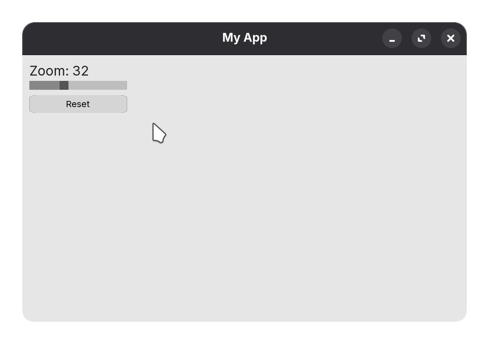

# Quickstart {#quickstart}

This page is a practical 5-minute guide to get a usable UI on screen.

## 1) Include Velvet

Use the umbrella include:

@code{.cpp}
#include <velvet/core>
@endcode

This includes all the core basic layout and widget components needed for velvet to function.

## 2) Window & Layout
The application runs inside a `Window`, constructed with the `width`, `height`, and the `title` as parameters.
@code{.cpp}
Window window(width, height, title);
@endcode

Velvet uses a `Stack` for layout and positioning. Stacks exist in Vertical or Horizontal directions and can be declared as follows:

@code{.cpp}
Stack stack(StackDirection::Horizontal, gap);   // horizontal stack
Stack stack(StackDirection::Vertical, gap);     // vertical stack
@endcode
For convenience, you can use the shorthand `HStack` and `VStack` declarations:

@code{.cpp}
HStack stack(gap);    // horizontal stack
VStack stack(gap);    // vertical stack
@endcode

`gap` is the spacing between child elements of the layout stacks (similar to flexbox gap in CSS)

**Example:**

@code{.cpp}
Window window(1000, 600, "My App");    // 1000x600 window with the title "My App"
VStack root(12);                       // vertical stack with 12px gap
root.setPadding(16);                   // content padding inside stack
@endcode

Create widgets and add them to layout stacks using `add( ... )`.

## 3) Add widgets

The `add()` function exists on both `Widget` and `Stack`. It accepts 'n' widgets or pointers to widgets.

@code{.cpp}
Label title("Dashboard", {
    {"fontSize", 30.f},
    {"fillColor", 0x202020FFu}
});

Slider zoom(220, 0.f, 100.f);
Button reset(220, 40, "Reset");

root.add(title, &zoom);    // pass in as many widgets/pointers as needed.
root.add(reset);           // also works with just one element
@endcode

## 4) Event Callbacks

`zoom` in the current code so far is a `Slider`, which has the `onchange` callback:
@code{.cpp}
zoom.onchange = [&](float value) {
    title.setText("Zoom: " + std::to_string((int)value));
};
@endcode

Similarly, `Button` with `onclick`:
@code{.cpp}
reset.onclick = [&] {
    title.setText("Dashboard");
};
@endcode

## 5) Finally, compose and run
Ensure you add all the `Stack` layouts to the base window:
@code{.cpp}
window.add(root); // adding root VStack to the window
window.run();
@endcode

## Altogether:
@code{.cpp}
#include <velvet/core>

int main() {
    // window setup
    Window window(1000, 600, "Velvet");
    VStack root(12);
    root.setPadding(16);

    // widgets
    Label title("Dashboard", {
        {"fontSize", 30.f},
        {"fillColor", 0x202020FFu}
    });
    
    Slider zoom(220, 0.f, 100.f);
    Button reset(220, 40, "Reset");
    
    root.add(title, &zoom);
    
    // events
    zoom.onchange = [&](float value) {
        title.setText("Zoom: " + std::to_string((int)value));
    };
    reset.onclick = [&] {
        title.setText("Dashboard");
    };
    
    // composition and run
    root.add(reset); // you can add widgets anywhere BEFORE adding the stack to the window/parent stack!

    window.add(root);

    window.run();
}
@endcode

## Notes about file paths

Some widgets load assets like fonts/textures with relative paths (example `src/assets/...`). Run your app from the project root, or provide paths that are valid for your execution directory. See `Button` and `Label` custom fonts and `Image` paths.

## Widget Guide

Head on over to the [Widget Guide](widgets.md) to find API references on all the widgets you can use within Velvet.